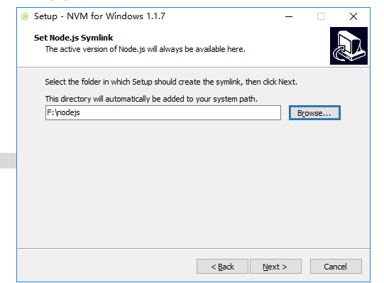

## 安装NVM
如果已经安装好了Node，建议先卸载

在下载页面中选择nvm-setup.zip进行下载
[点击进入下载页面](https://github.com/coreybutler/nvm-windows/releases)

下载完成后只有新建一个nodejs文件夹，用来映射当前使用的node



安装完成以后使用nvm -v 来查看安装的版本
如果能看到版本号，表示安装成功

键入命令
``` bash
$  nvm list available
```
查看可安装的node版本，通过nvm install node版本号来安装node

华舰啊啊啊a

测试更新博客

测试更新博客2

[需要关注的博客](https://wellwind.idv.tw/blog/)
## 安装Node
## angular-cli

